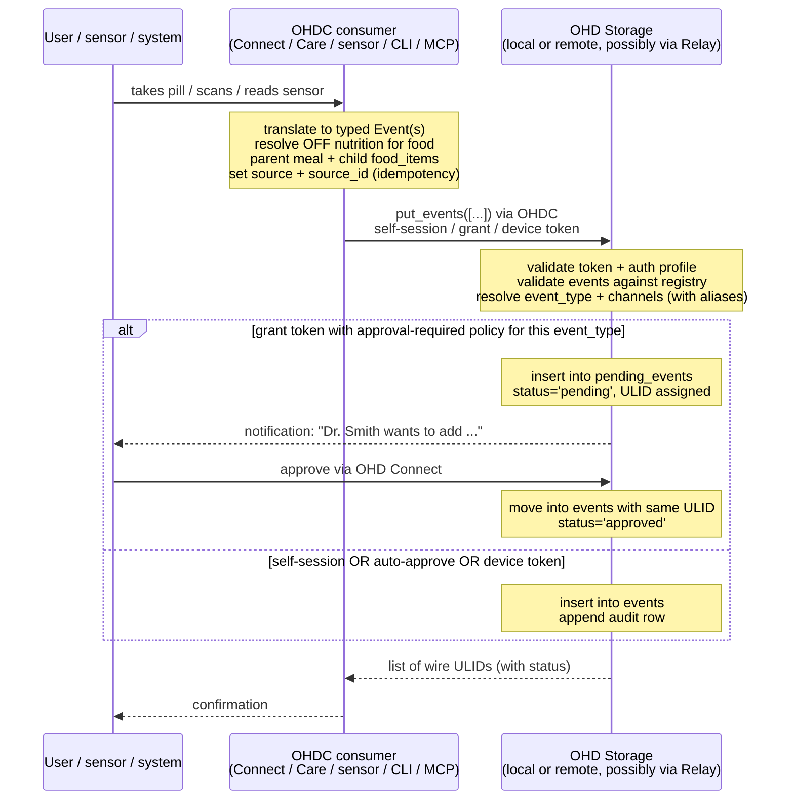
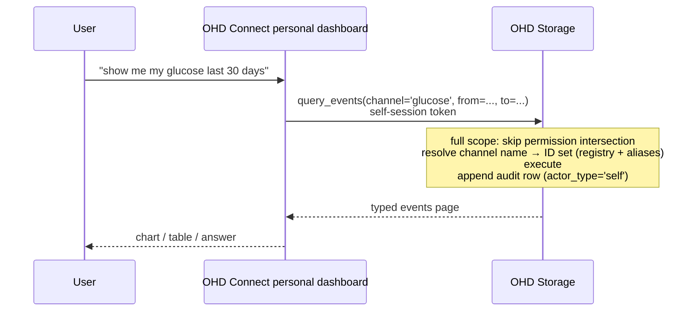
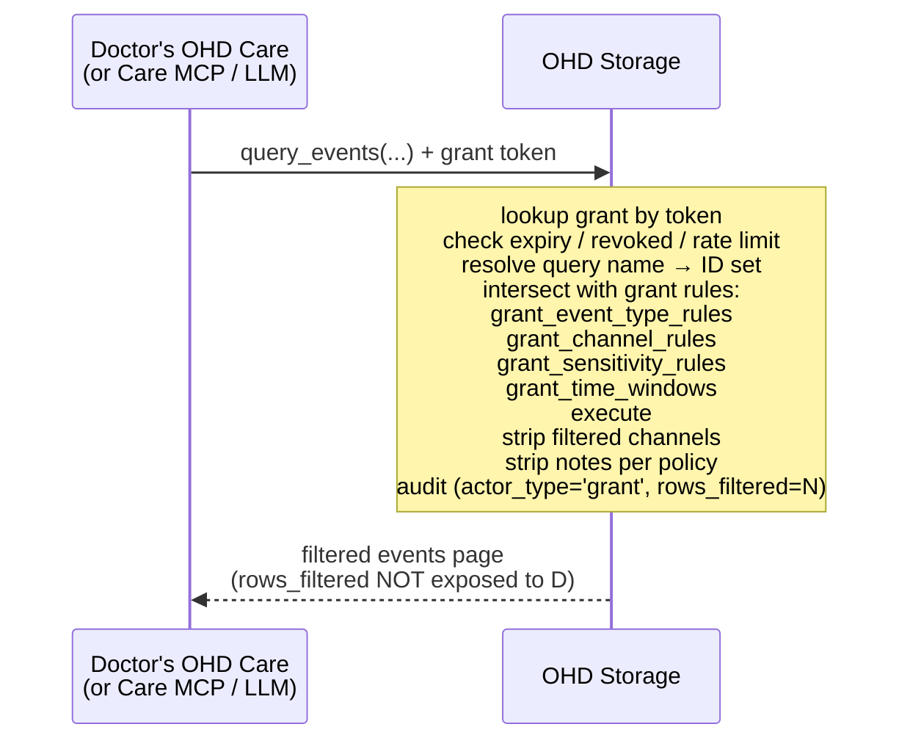
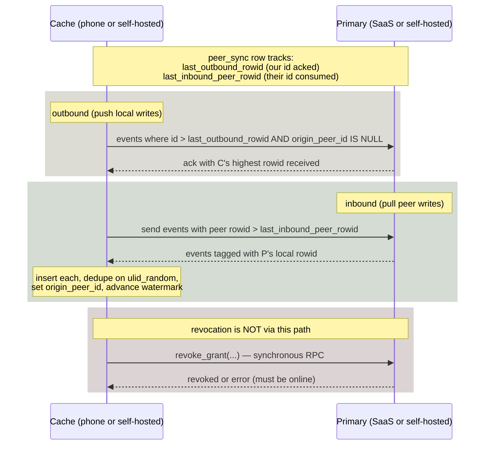
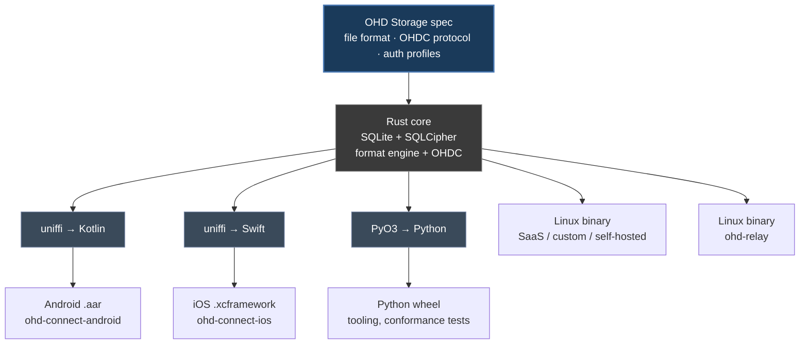

# OHD architecture — Claude's externalized model

Visual / mermaid externalization of the architecture, aligned with the current spec. The spec is canonical; this doc is a review aid showing the same model in diagram form. Scrap after the review pass if it doesn't add value.

---

## 1. The four components

```mermaid
flowchart TB
    classDef product fill:#1a3a5a,color:#fff,stroke:#4a7ab5,stroke-width:2px
    classDef proto fill:#3a3a5a,color:#fff,stroke:#7a7ab5,stroke-width:2px
    classDef bridge fill:#5a4a2a,color:#fff,stroke:#9a8a4a,stroke-width:2px
    classDef client fill:#2a5a3a,color:#fff,stroke:#5ab57a
    classDef external fill:#5a3a2a,color:#fff,stroke:#b57a5a

    subgraph CORE [OHD Storage — core product]
        STORAGE[<b>OHD Storage</b><br/>format · permissions · audit<br/>grants · sync · encryption]
        OHDC_API[<b>OHDC protocol</b><br/>single API, three auth profiles:<br/>• self-session<br/>• grant token<br/>• device token]
        STORAGE --- OHDC_API
    end
    class STORAGE product
    class OHDC_API proto

    RELAY[<b>OHD Relay</b><br/>bridge: remote OHDC consumers ↔<br/>storage without public IP<br/>(phone-only, home NAT)<br/>opaque packet relay, no decrypt]
    class RELAY bridge

    subgraph PERSONAL [OHD Connect — personal app]
        CONN_APP[Android / iOS / Web<br/>logging, dashboard,<br/>grants, audit, exports]
        CONN_MCP[Connect MCP<br/>LLM tools for personal use]
        CONN_CLI[ohd-connect CLI]
    end
    class CONN_APP,CONN_MCP,CONN_CLI client

    subgraph CARE [OHD Care — clinical app]
        CARE_APP[Web SPA<br/>multi-patient roster<br/>per-patient view<br/>visit prep + chart builder]
        CARE_MCP[Care MCP<br/>switch_patient context<br/>read + write-with-approval tools]
        CARE_CLI[ohd-care CLI]
    end
    class CARE_APP,CARE_MCP,CARE_CLI client

    subgraph INTEGRATIONS [Third-party integrations]
        LIBRE[Libre / Dexcom / sensors<br/>(device tokens)]
        LAB[Lab providers<br/>(device tokens)]
        EHR[Hospital EHRs<br/>(device or grant tokens)]
    end
    class LIBRE,LAB,EHR client

    subgraph EXT [External]
        HC[Health Connect / HealthKit]
        OFF[OpenFoodFacts]
        OIDC[OIDC providers]
    end
    class HC,OFF,OIDC external

    CONN_APP --> HC
    CONN_APP --> OFF

    CONN_APP -- self-session --> OHDC_API
    CONN_MCP -- self-session --> OHDC_API
    CONN_CLI -- self-session --> OHDC_API
    CARE_APP -- grant tokens --> OHDC_API
    CARE_MCP -- grant tokens --> OHDC_API
    CARE_CLI -- grant tokens --> OHDC_API
    LIBRE -- device tokens --> OHDC_API
    LAB -- device tokens --> OHDC_API
    EHR -- device or grant tokens --> OHDC_API

    CARE_APP -. via Relay if storage unreachable .-> RELAY
    RELAY --> OHDC_API
    STORAGE -- auth delegation --> OIDC
```

**Invariants:**

- **One protocol, three auth profiles.** OHDC is the single external API. Capability comes from the token's auth profile (self-session / grant / device), not from a different protocol.
- **OHD Care is real.** Lightweight reference EHR-shaped consumer, not a demo. Designed for OHD-data-centric clinical workflows in small clinics, mobile / ambulance, specialists, direct-pay, clinical trials, etc. Not competing with Epic.
- **OHD Relay handles unreachable storage.** Phones (NAT, sleep) and home self-hosted (residential NAT) both route through Relay. Sees ciphertext only.
- **Device tokens are a kind of grant.** `grants.kind='device'` with write-only scope and no expiry. Same machinery as third-party grants; cheaper damage cap.

---

## 2. Three auth profiles, one protocol

```mermaid
flowchart LR
    classDef self fill:#2a4a3a,color:#fff,stroke:#5a8a6a
    classDef grant fill:#3a3a5a,color:#fff,stroke:#6a6a9a
    classDef device fill:#5a4a2a,color:#fff,stroke:#9a8a4a
    classDef proto fill:#1a3a5a,color:#fff,stroke:#4a7ab5,stroke-width:2px

    subgraph SELF [Self-session]
        SELF_TOK[OIDC bearer<br/>short TTL]
        SELF_OPS[full ops on own data:<br/>read, write, manage grants,<br/>audit, export, import,<br/>approve/reject pending]
        SELF_DAMAGE[damage if leaked:<br/>own data; standard re-auth window]
    end
    class SELF_TOK,SELF_OPS,SELF_DAMAGE self

    subgraph GRANT [Grant token]
        GRANT_TOK[opaque random or signed<br/>resolves to grants row<br/>scoped + expiring]
        GRANT_OPS[bounded by grant rules:<br/>• read scope (types/channels/<br/>  sensitivity/time)<br/>• write scope + approval mode<br/>• rate limits]
        GRANT_DAMAGE[damage if leaked:<br/>what grant allowed only]
    end
    class GRANT_TOK,GRANT_OPS,GRANT_DAMAGE grant

    subgraph DEVICE [Device token]
        DEV_TOK[long-lived, write-only<br/>grants.kind='device'<br/>attributed by device_id]
        DEV_OPS[append events only<br/>cannot read history<br/>cannot list grants]
        DEV_DAMAGE[damage if leaked:<br/>forge events under device id<br/>cannot exfiltrate]
    end
    class DEV_TOK,DEV_OPS,DEV_DAMAGE device

    OHDC[<b>OHDC API</b><br/>same operations<br/>auth profile gates capability]
    class OHDC proto

    SELF --> OHDC
    GRANT --> OHDC
    DEVICE --> OHDC
```

Mixed-scope grants are natural in this model — a doctor with read scope on vitals + write scope (approval-required) on `lab_result` + auto-approve on `clinical_note` is one grant, not three protocols stitched together.

---

## 3. Deployment topologies

```mermaid
flowchart TB
    classDef phone fill:#2a4a3a,color:#fff,stroke:#5a8a6a
    classDef server fill:#3a3a5a,color:#fff,stroke:#6a6a9a
    classDef storage fill:#1a3a5a,color:#fff,stroke:#4a7ab5,stroke-width:2px
    classDef bridge fill:#5a4a2a,color:#fff,stroke:#9a8a4a

    subgraph T1 [On-device]
        P1[Phone]
        S1[OHD Storage<br/>on phone]
        R1[OHD Relay]
        D1[Doctor's OHD Care]
        P1 -- in-process --> S1
        P1 -. paired NFC/QR .-> R1
        D1 -. paired NFC/QR .-> R1
    end
    class P1,D1 phone
    class S1 storage
    class R1 bridge

    subgraph T2 [OHD Cloud]
        P2[Phone]
        S2[OHD Storage<br/>OHD project SaaS]
        D2[Doctor's OHD Care]
        P2 -- HTTP/3 --> S2
        D2 -- HTTP/3 --> S2
    end
    class P2,D2 phone
    class S2 storage

    subgraph T3 [Custom provider]
        P3[Patient phone]
        S3[OHD Storage<br/>at clinic / insurer / employer]
        E3[Hospital EHR<br/>OHDC integration]
        D3[Operator's OHD Care]
        P3 --> S3
        E3 --> S3
        D3 --> S3
    end
    class P3,D3,E3 phone
    class S3 storage

    subgraph T4 [Self-hosted]
        P4[Phone]
        S4[OHD Storage<br/>user's VPS / NAS]
        R4[OHD Relay<br/>if behind NAT]
        D4[Granted OHD Care]
        P4 --> S4
        S4 -. tunnels via .-> R4
        D4 -. via Relay .-> R4
    end
    class P4,D4 phone
    class S4 storage
    class R4 bridge
```



User picks at app setup. Same code, same protocol, same on-disk format in all four. Relay is on the path for on-device and for self-hosted-without-public-IP.

---

## 4. Write path (any OHDC consumer)



---

## 5. Read path — self-session (own data)



---

## 6. Read path — grant token (third party)



The user later inspects `audit_log WHERE grant_id=? AND rows_filtered > 0` to see what was hidden from each grantee.

---

## 7. Live access via OHD Relay (on-device)

```mermaid
sequenceDiagram
    participant P as Phone<br/>(on-device storage)
    participant R as OHD Relay<br/>(project / clinic / user)
    participant C as Doctor's OHD Care
    participant L as LAN fast-path probe

    Note over P,C: NFC tap or QR scan at desk<br/>handshake: Relay URL, pairing nonce, grant
    
    P->>R: open HTTP/3, present nonce
    C->>R: open HTTP/3, present nonce
    Note over P,C: TLS handshake end-to-end<br/>through Relay (Relay sees ciphertext only)
    
    par OHDC operations
        C->>R: query / submit + grant token (inside TLS)
        R->>P: forwarded
        P-->>R: response
        R-->>C: forwarded
    and LAN probe
        L-->>C: phone reachable on LAN
        C->>P: switch to direct LAN (same TLS, lower latency)
    end
    
    Note over P: phone disconnects
    R-->>C: session ends; cached snapshot under operator's HIPAA posture
```

Self-hosted home storage uses the same Relay shape but with grant-mediated registration (durable tunnel) instead of in-person pairing.

---

## 8. Sync between primary and cache



Watermarks are insertion-order (rowid), not measurement time, so backfills and pre-1970 events sync correctly.

---

## 9. Two MCPs, distinct contexts

```mermaid
flowchart LR
    classDef conn fill:#2a4a3a,color:#fff,stroke:#5a8a6a
    classDef care fill:#3a3a5a,color:#fff,stroke:#6a6a9a
    classDef storage fill:#1a3a5a,color:#fff,stroke:#4a7ab5,stroke-width:2px

    subgraph CONN_M [Connect MCP — personal context]
        CONN_T[Self-session token<br/>single user, full scope]
        CONN_TOOLS[Tools:<br/>log_symptom / log_food / log_medication /<br/>log_measurement / log_exercise / log_mood /<br/>log_sleep / log_free_event<br/><br/>query_events / query_latest / summarize /<br/>correlate / find_patterns / chart<br/><br/>create_grant / revoke_grant / list_grants<br/>list_pending / approve_pending / reject_pending<br/>audit_query]
    end
    class CONN_T,CONN_TOOLS conn

    subgraph CARE_M [Care MCP — clinical context]
        CARE_T[Grant tokens<br/>multi-patient<br/>active patient = active grant]
        CARE_TOOLS[Tools:<br/>list_patients / switch_patient / current_patient<br/><br/>query_events / query_latest / summarize /<br/>correlate / find_patterns / chart /<br/>get_medications_taken / get_food_log<br/><br/>submit_lab_result / submit_measurement /<br/>submit_observation / submit_clinical_note /<br/>submit_prescription / submit_referral<br/>(write-with-approval per grant policy)<br/><br/>draft_visit_summary / compare_to_previous_visit /<br/>find_relevant_context_for_complaint]
    end
    class CARE_T,CARE_TOOLS care

    STORE[OHD Storage<br/>OHDC API]
    class STORE storage

    CONN_TOOLS --> STORE
    CARE_TOOLS --> STORE
```

Care MCP's distinctive feature is **active-patient context** — `switch_patient(label)` sets which grant is in scope for subsequent calls. A doctor session moves between patients via explicit switches; submission tools confirm "submitting to Alice — confirm?" before going through.

---

## 10. Implementation language



Same Rust core, byte-identical on-disk format on every platform. A file written by Android opens unchanged on a Linux server.

---

## 11. Trust / security boundaries

```mermaid
flowchart TB
    classDef secure fill:#2a3a5a,color:#fff,stroke:#5a7ab5
    classDef plaintext fill:#5a3a3a,color:#fff,stroke:#b55a5a
    classDef key fill:#5a4a2a,color:#fff,stroke:#9a8a4a

    subgraph PHONE [Phone (on-device)]
        APP[OHD Connect app — sees plaintext]
        STORE_F[OHD Storage file<br/>SQLCipher AES-256]
        BLOBS[blob sidecar<br/>per-user-key encrypted]
        KEYSTORE[Device keystore<br/>biometric-unlocked]
    end
    class APP,STORE_F,BLOBS plaintext
    class KEYSTORE key

    subgraph SERVER [Server / SaaS / clinic]
        SVC[OHD Storage service — sees plaintext]
        STORE_S[OHD Storage file<br/>SQLCipher AES-256]
        BLOBS_S[blob sidecar]
        FS_KEY[server-managed key wrap]
    end
    class SVC,STORE_S,BLOBS_S plaintext
    class FS_KEY key

    subgraph WIRE [Wire / Relay]
        RELAY[OHD Relay<br/>sees TLS ciphertext only]
    end
    class RELAY secure

    KEYSTORE -. unlocks .-> STORE_F
    KEYSTORE -. unlocks .-> BLOBS
    APP -. plaintext in-process .-> STORE_F

    APP -- TLS --> RELAY
    SVC -- TLS --> RELAY
    SVC -. unlocks .-> STORE_S
    SVC -. unlocks .-> BLOBS_S
```

End-to-end channel encryption (so the operator can't read the most sensitive sensitivity classes even at the engine level) is reserved in the format but not yet specified at the bit level.

---

## 12. Open design items

These have spec acknowledgement and don't block implementation; they're explicitly deferred:

1. **End-to-end channel encryption** for sensitive sensitivity classes. Reserved space in the schema; key-wrapping format and grant-side ciphertext semantics TBD.
2. **Sync wire protocol details**. Storage primitives are spec'd (peer_sync, origin_peer_id, ULID dedup, rowid watermarks). Wire framing, batch sizes, retry semantics are not.
3. **Live access protocol details**. Relay's pairing nonce shape, grant-mediated registration token format, LAN fast-path discovery (mDNS vs alternatives) sketched but not specified.
4. **Family / delegate access**. `grants.kind='delegate'` is a placeholder for "one user acts on behalf of another". Authority semantics TBD.
5. **Source signing**. Optional integration-level signing (Libre / lab providers signing their submissions); key management, signature format, UI surface TBD.
6. **Standard registry governance**. How new standard event types and channels get added. Founder-decides for now; documented contribution process when project has more than one contributor.
7. **Approval-policy templates**. Common bundles ("primary doctor", "specialist for one visit", "research participant", "emergency contact") shipped as defaults to lower the bar for grant creation.

---

## How to use this doc

This is a visual mirror of the spec. If a diagram conflicts with the spec text, the spec wins. Edit any box you think is wrong; flag conceptual disagreements; I'll re-sync. Once the spec review pass is done, this doc can be scrapped or archived.
